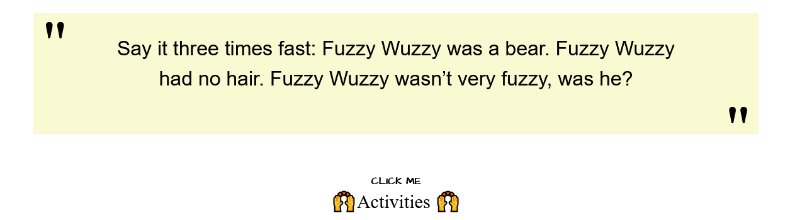

# Learndomly
A site which help you decide what to do today. 
Made for Polihack 11 (2020).  
Having a time constraint of 2 days
 
__*Winners of Web category*__   
Team members:
* Gavrila Tiberiu (JS functionality)
* Tudor Roxana (CSS and design) 
* Maglaviceanu Bernard (additional design)
* Raita Anamaria
* Draghici Anca (pitch, idea validation, and market research).

### Languages used:
* HTML
* CSS
* JavaScript 

### Functionalities
A site to help you alievate boredom by generating random youtube videos (called "tutorials") or 
suggesting random "activities".

The user can decide how to filter the videos or activities and click space in order to get a new one.

A few images from the website: 

The landing page

The tutorials generator genereates a new video when you press spacebar

Activities and tutorials button change when you click on it. Hovering over the button will make it yellow

Activites generator

Show filter button

Easter eggs hidden on webpage

We decided to hide easter eggs in order to make the website more interactive and fun. Because it was developed during the COVID pandemic we decided to integrate jokes about the coronavirus. 
